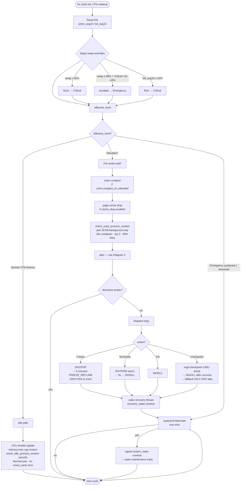
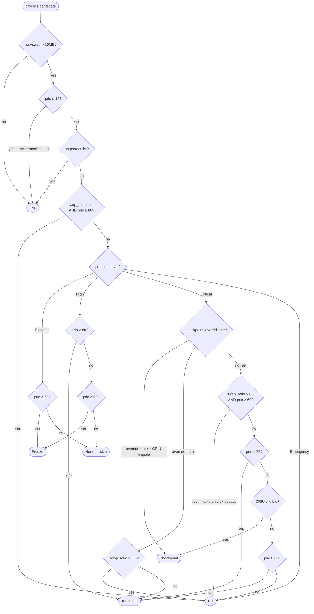
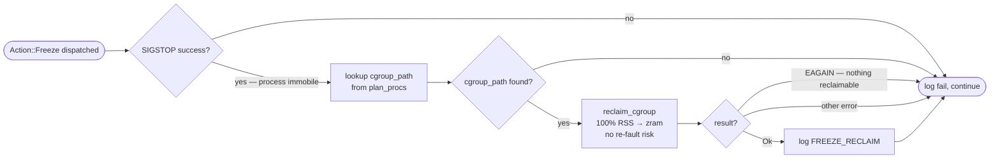
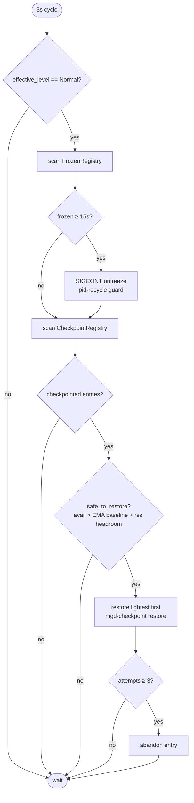
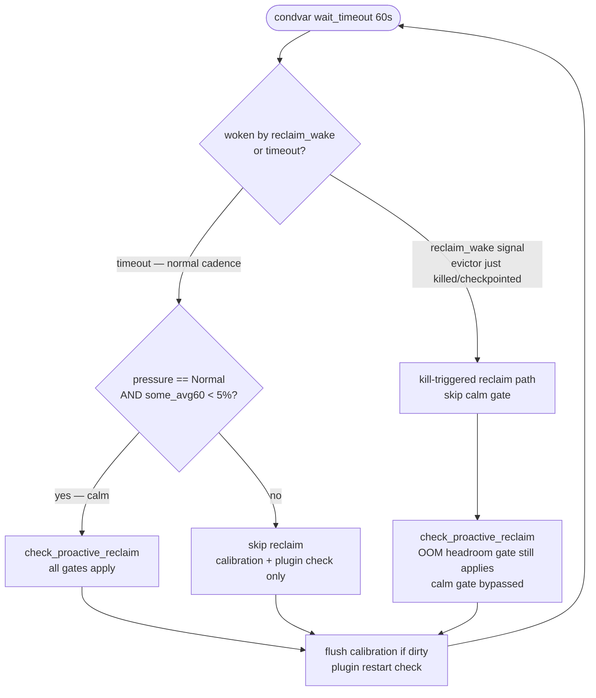

# MGD Decision Tree

## 1. Evictor Main Loop (5s cycle)

---

## 2. Per-Process Decision — `plan()` + `determine_process_action()`

---

## 3. Post-Freeze Reclaim

---

## 4. Recovery Loop (3s cycle)

## 5. Maintenance Loop (60s cadence or kill-triggered)

**Gate comparison:**

| Gate | Calm path | Kill-triggered path |
|------|-----------|-------------------|
| `pressure == Normal` | required | **bypassed** |
| `some_avg60 < 5%` | required | **bypassed** |
| cooldown elapsed | required | required |
| `zram_used ≥ min_mb` | required | required |
| OOM headroom `avail > footprint × 1.5` | required | required |

---

## Priority Tiers (config/priorities.toml)

| Range | Tier | Examples | Behaviour |
|-------|------|----------|-----------|
| 0–19 | System/critical | kwin_wayland, pipewire, systemd | **Never touched** |
| 20–49 | Protected apps | claude, firefox, video-calls | Nothing at Elevated/High · Checkpoint (CRIU) or Kill (no CRIU) at Critical · Kill at Emergency |
| 50–59 | Normal background | generic user apps | `check_early_process_reclaim` target (50% RSS, 30s cooldown) · Nothing at Elevated/High · Checkpoint or Kill at Critical |
| 60–79 | Expendable background | baloo, tracker, updates | Freeze+FREEZE_RECLAIM at Elevated · Freeze at High · Checkpoint/Terminate/Kill at Critical |
| 80–100 | Expendable heavy | msedge, electron apps | Freeze+FREEZE_RECLAIM at Elevated · Terminate at High · Terminate (swap_ratio≤0.5) or Kill (swap_ratio>0.5) at Critical · Kill at swap_exhausted |

**Foreground priority adjustment:** the active foreground process (reported by DE plugin via `ActiveWindow`) gets `prio = max(prio - 25, 20)` before entering `plan()`. This REDUCES effective priority — a prio 80 browser in focus becomes prio 55, below the Freeze threshold at Elevated (need ≥ 60). It never elevates prio 20–49 processes; they stay protected.

---

## Pressure Level Thresholds (defaults, overridable via `[psi]`)

| Level | some_avg10 | Trigger |
|-------|-----------|---------|
| Normal | < 5% | idle reclaim, throttle only |
| Elevated | ≥ 5% | early reclaim + plan → Freeze prio≥60 |
| High | ≥ 25% | plan → Terminate prio≥80, Freeze prio≥60 |
| Critical | ≥ 50% | plan → Kill/Terminate/Checkpoint |
| Emergency | ≥ 70% | Kill all · hibernate if sustained |

Overrides: `full_avg10 ≥ 20%` forces Critical floor. `swap ≥ 95%` forces Critical. `swap ≥ 98%` + Critical sustained 45s → Emergency.
